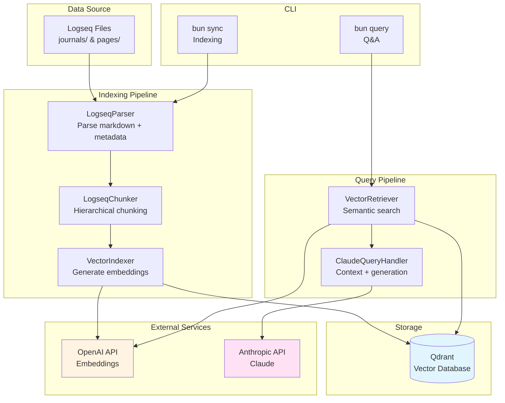
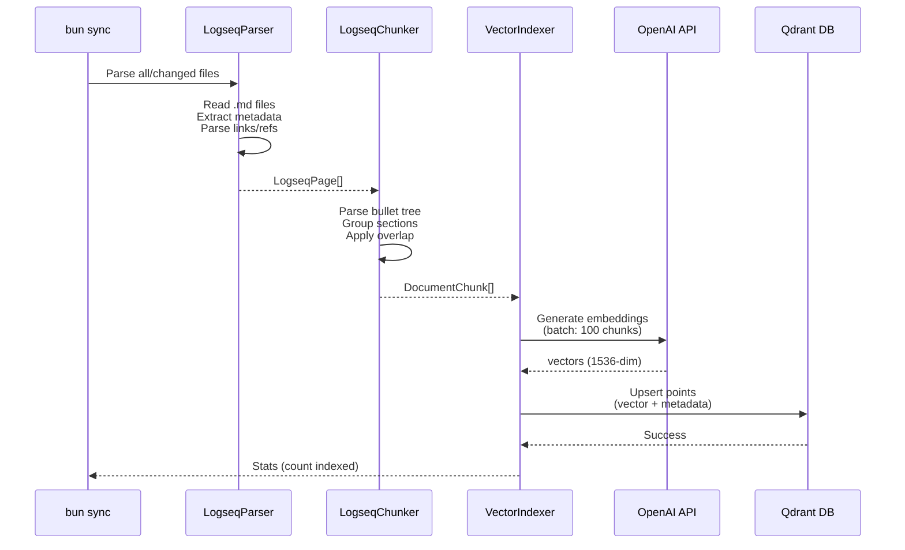
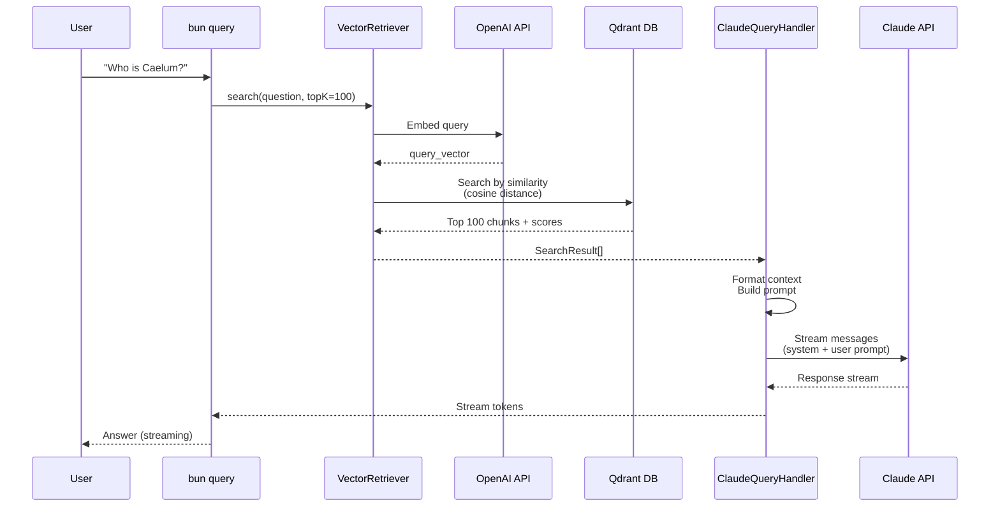
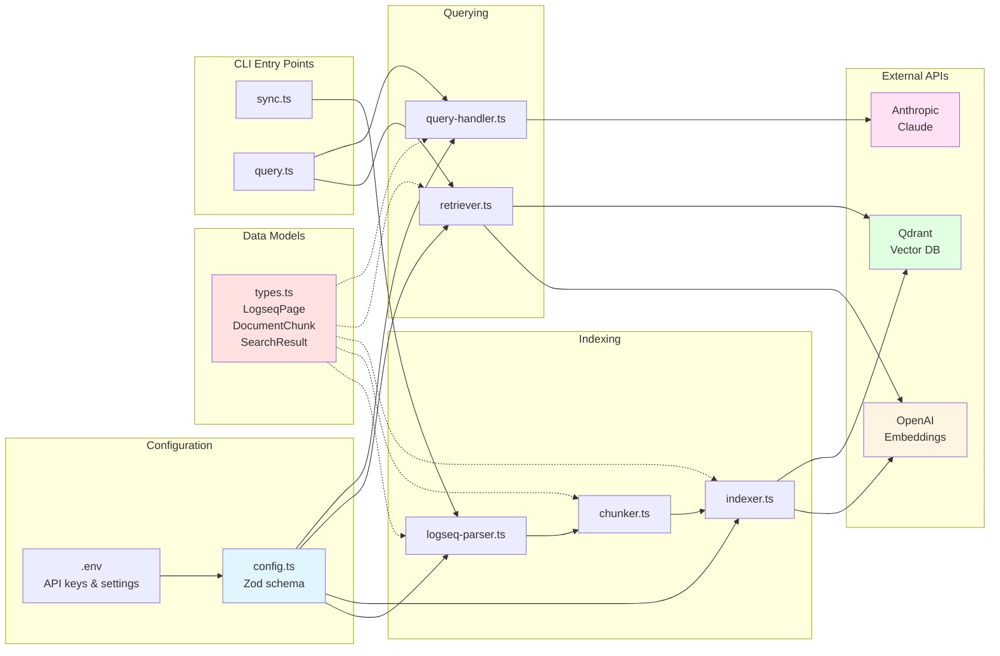
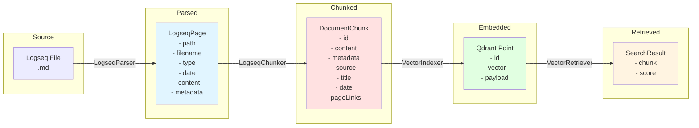

# Architecture

## Introduction

This is a **Retrieval-Augmented Generation (RAG)** system designed to help Dungeon Masters query D&D campaign notes stored in Logseq using semantic search and AI-powered responses.

### What is RAG?

RAG combines two approaches:
1. **Retrieval**: Find relevant information from a knowledge base using semantic search
2. **Generation**: Use an LLM to synthesize an answer based on retrieved context

This enables Claude to answer questions about your specific campaign notes, not just general D&D knowledge.

### Technology Stack

| Component | Technology | Purpose |
|-----------|-----------|---------|
| **Runtime** | TypeScript + Bun | Type-safe, fast execution |
| **Embeddings** | OpenAI text-embedding-3-small | Convert text to 1536-dim vectors |
| **Vector Database** | Qdrant (Docker) | Store and search embeddings |
| **LLM** | Claude Haiku 4.5 | Generate answers from context |
| **Source Format** | Logseq Markdown | Hierarchical note-taking |

---

## System Overview



---

## Core Concepts

### 1. Vector Embeddings

**What**: Numerical representations of text that capture semantic meaning.

**How it works**:
- "Who is Caelum?" → `[0.23, -0.45, 0.12, ...]` (1536 numbers)
- Similar meanings = similar vectors
- Search by measuring distance between vectors

**Example**:
```
"Caelum Fenovar is a captain" → [0.2, 0.5, ...]
"Who is Caelum?"              → [0.3, 0.4, ...]
                                 ↑ Close distance = relevant!
```

### 2. Logseq Structure

Logseq organizes notes hierarchically:

**Journals** (`journals/2024_12_27.md`):
- Date-based session notes
- Timeline tracking built-in

**Pages** (`pages/Caelum Fenovar.md`):
- NPCs, locations, concepts
- Interconnected via `[[links]]`

**Syntax**:
- `[[Page Name]]` - Links to other pages
- `((uuid))` - Block references
- Tab-indented bullets - Hierarchical structure

### 3. Chunking Strategy

**Problem**: Embeddings work best on focused chunks, not entire files.

**Solution**: Preserve Logseq's hierarchical structure.

```
Before (naive):                After (hierarchical):
├─ Chunk 1: First 800 chars   ├─ Chunk 1: Caelum section
├─ Chunk 2: Next 800 chars    │   ├─ Background
└─ Chunk 3: ...                │   └─ Beliefs
                               └─ Chunk 2: Seekers section
                                   └─ Concerns
```

**Benefits**:
- Semantic coherence within chunks
- Context preservation (parent bullets included)
- No mid-thought cutoffs

### 4. Semantic Search

Traditional search: Keyword matching ("Find 'Caelum'")
Semantic search: Meaning matching ("Find captain characters")

**How Qdrant searches**:
1. Convert query to vector embedding
2. Measure cosine similarity to all stored vectors
3. Return top-K closest matches with scores

---

## Architecture Layers

### Layer 1: Data Source
**Component**: Logseq filesystem
**Format**: Markdown files with frontmatter
**Structure**: `journals/` (date-based) + `pages/` (entities)

### Layer 2: Indexing Pipeline
**Components**: LogseqParser → LogseqChunker → VectorIndexer
**Process**: Parse → Chunk → Embed → Store
**Trigger**: Manual (`bun sync`)

### Layer 3: Vector Storage
**Component**: Qdrant container
**Data**: 1536-dim vectors + metadata payloads
**Operations**: Upsert, search, delete by filter

### Layer 4: Query Pipeline
**Components**: VectorRetriever → ClaudeQueryHandler
**Process**: Embed query → Search → Format → Generate
**Trigger**: User question (`bun query`)

### Layer 5: CLI Interface
**Tools**: `sync.ts`, `query.ts`
**Config**: Environment variables via Zod validation

---

## Indexing Flow



**Key Steps**:

1. **Parse**: Extract content + metadata (dates, links, block refs)
2. **Chunk**: Preserve hierarchical bullets, ~800 tokens per chunk
3. **Embed**: Generate 1536-dim vectors via OpenAI
4. **Store**: Insert into Qdrant with rich metadata

**Modes**:
- `full`: Reindex all files (initial setup)
- `incremental`: Only files modified in last 24 hours

---

## Query Flow



**Key Steps**:

1. **Embed**: Convert question to vector
2. **Search**: Find top-K similar chunks in Qdrant
3. **Format**: Structure context with citations (dates, sources, scores)
4. **Generate**: Claude synthesizes answer from context
5. **Stream**: Real-time output to user

---

## Component Relationships



---

## Key Design Decisions

### Why Hierarchical Chunking?

**Problem**: Logseq notes are hierarchical bullets. Naive chunking breaks semantic units.

**Solution**: Parse bullet trees and chunk by logical sections.

**Trade-off**: More complex parser, but preserves meaning and context.

---

### Why Qdrant?

**Alternatives considered**: Pinecone, ChromaDB, Weaviate

**Why Qdrant**:
- Excellent local Docker support
- Easy migration to cloud (change 1 env var)
- Rich metadata filtering (date ranges)
- Fast cosine similarity search
- REST API simplicity

---

### Why Claude Haiku 4.5?

**Alternatives**: GPT-4, Claude Sonnet, Llama

**Why Haiku**:
- **Speed**: 2x faster than Sonnet
- **Cost**: $1/$5 per million tokens (cheap for RAG)
- **Quality**: Excellent for factual context-based answers
- **Context**: 200K tokens (fits 100+ chunks easily)

---

### Why Store Metadata in Vectors?

**Alternative**: Separate metadata database

**Why in payloads**:
- Simpler architecture (one data store)
- Atomic operations (vector + metadata together)
- Filtering support (date ranges, source paths)
- Easy reconstruction of SearchResults

**Trade-off**: Slightly larger payload size, but negligible for this scale.

---

### Incremental Sync Strategy

**Approach**: Full file reindex on change (delete all chunks from source → re-chunk → re-embed)

**Why not partial updates**:
- Chunk boundaries depend on entire file structure
- Editing one section can shift all subsequent chunks
- Simpler to reason about (no stale chunks)

**Cost**: Minimal (only changed files, ~100KB/week = $0.002)

---

## Data Models



### Transformation Pipeline

1. **LogseqPage**: Raw file with extracted metadata
   - Includes: frontmatter, links, block refs, dates

2. **DocumentChunk**: Semantically coherent section
   - Includes: chunk index, parent page metadata

3. **Qdrant Point**: Vector + metadata
   - Includes: 1536-dim embedding, full payload

4. **SearchResult**: Retrieved chunk + relevance
   - Includes: cosine similarity score (0-1)

---

## External Dependencies

### OpenAI Embeddings API

**Documentation**: [OpenAI Embeddings Guide](https://platform.openai.com/docs/guides/embeddings)

**Model**: `text-embedding-3-small`
- **Dimensions**: 1536
- **Cost**: $0.02 per 1M tokens
- **Use case**: Converting text to vectors

**Integration**:
```typescript
const response = await openai.embeddings.create({
  model: 'text-embedding-3-small',
  input: texts,
  dimensions: 1536,
});
```

---

### Anthropic Claude API

**Documentation**: [Claude Messages API](https://docs.anthropic.com/claude/reference/messages_post)

**Model**: `claude-haiku-4-5-20251001`
- **Context**: 200K tokens
- **Cost**: $1/$5 per 1M tokens (input/output)
- **Use case**: Generating answers from context

**Integration**:
```typescript
const stream = await anthropic.messages.stream({
  model: 'claude-haiku-4-5-20251001',
  max_tokens: 2000,
  system: systemPrompt,
  messages: [{ role: 'user', content: userPrompt }],
});
```

**Streaming**: Full support for real-time token output

---

### Qdrant Vector Database

**Documentation**: [Qdrant Docs](https://qdrant.tech/documentation/)

**Deployment**: Docker container (local) or cloud

**Key Concepts**:
- **Collections**: Namespaced vector storage
- **Points**: Vector + payload (metadata)
- **Distance**: Cosine similarity for semantic search
- **Filtering**: Metadata-based query constraints

**Integration**:
```typescript
await qdrant.createCollection(name, {
  vectors: { size: 1536, distance: 'Cosine' }
});

await qdrant.upsert(name, {
  points: [{ id, vector, payload }]
});

const results = await qdrant.search(name, {
  vector: queryVector,
  limit: topK,
  filter: { must: [{ key: 'date', range: { gte: '2024-01-01' }}] }
});
```

---

### Logseq Documentation

**Documentation**: [Logseq Docs](https://docs.logseq.com/)

**Key Concepts**:
- **Journals**: Date-based daily notes
- **Pages**: Entity-based evergreen notes
- **Block References**: `((uuid))` links to specific blocks
- **Page Links**: `[[Name]]` links to pages
- **Hierarchical Bullets**: Tab-indented structure

**File Format**:
```markdown
---
title: Caelum Fenovar
---
- Veteran character
	- Worshipped [[Tempus]]
	- ((block-uuid)) reference
```

---

## Configuration Architecture

### Environment-Based Configuration

All settings loaded via `.env` file:

```bash
# Embeddings
OPENAI_API_KEY=sk-...
EMBEDDING_MODEL=text-embedding-3-small
EMBEDDING_DIMENSIONS=1536

# LLM
ANTHROPIC_API_KEY=sk-ant-...
CLAUDE_MODEL=claude-haiku-4-5-20251001

# Vector DB
QDRANT_URL=http://localhost:6333
QDRANT_COLLECTION_NAME=logseq-dnd-notes

# Source
LOGSEQ_PATH=/path/to/logseq

# Chunking
CHUNK_SIZE=800
CHUNK_OVERLAP=200

# Query
TOP_K_RESULTS=100
```

### Zod Validation Schema

**Benefits**:
- Type safety (compile-time + runtime)
- Default value handling
- Automatic coercion (string → number)
- Clear error messages for missing config

**Implementation**: `src/config.ts`

```typescript
const ConfigSchema = z.object({
  openai: z.object({
    apiKey: z.string().min(1),
    embeddingModel: z.string().default('text-embedding-3-small'),
    embeddingDimensions: z.coerce.number().default(1536),
  }),
  // ... other sections
});

export const config = ConfigSchema.parse(process.env);
```

---

## Extension Points

### 1. Custom Chunking Strategies

**Where**: `src/indexing/chunker.ts`

**Current**: Hierarchical bullet-based chunking

**Customization ideas**:
- Heading-based chunking (markdown `#` headers)
- Fixed-token chunking (ignore structure)
- Sliding window chunking
- Semantic similarity-based splits

**Interface**:
```typescript
class LogseqChunker {
  chunkPage(page: LogseqPage): DocumentChunk[]
}
```

---

### 2. Alternative Embedding Models

**Where**: `src/indexing/indexer.ts`, `src/querying/retriever.ts`

**Current**: OpenAI text-embedding-3-small

**Alternatives**:
- OpenAI text-embedding-3-large (3072 dims, higher quality)
- Voyage AI embeddings (optimized for RAG)
- Local models via HuggingFace (all-MiniLM-L6-v2)

**Requirements**:
- Update `EMBEDDING_DIMENSIONS` in config
- Recreate Qdrant collection
- Reindex all data

---

### 3. Different LLMs

**Where**: `src/querying/query-handler.ts`

**Current**: Claude Haiku 4.5

**Alternatives**:
- Claude Sonnet (better quality, slower)
- GPT-4 Turbo (OpenAI alternative)
- Local models via Ollama

**Interface**:
```typescript
class QueryHandler {
  async query(question: string, context: SearchResult[]): Promise<string>
  async streamQuery(question: string, context: SearchResult[], onToken: (token: string) => void): Promise<void>
}
```

---

### 4. Metadata Filters

**Where**: `src/querying/retriever.ts`

**Current**: Date range filtering

**Extension ideas**:
- Filter by page type (journals vs pages)
- Filter by specific page links (`[[NPC Name]]`)
- Filter by source directory
- Combine multiple filters (AND/OR logic)

**Qdrant filter syntax**:
```typescript
const filter = {
  must: [
    { key: 'type', match: { value: 'journal' }},
    { key: 'date', range: { gte: '2024-01-01' }}
  ]
};
```

---

### 5. Query Preprocessing

**Where**: `src/query.ts`

**Current**: Direct question → embed → search

**Enhancement ideas**:
- Query expansion (add synonyms)
- Entity extraction (detect NPC names, locations)
- Multi-query (ask multiple variations, merge results)
- Query rewriting (optimize for semantic search)

**Example**:
```typescript
function preprocessQuery(question: string): string {
  // Expand "who" questions to include context
  if (question.toLowerCase().startsWith('who is')) {
    return question + ' background role relationships';
  }
  return question;
}
```

---

## Summary

### System Philosophy

This RAG system is designed around three core principles:

1. **Preserve Structure**: Respect Logseq's hierarchical format during chunking
2. **Rich Context**: Store comprehensive metadata for filtering and citation
3. **Cost-Effective**: Use efficient models (Haiku, small embeddings) for reasonable cost

### When to Use This Architecture

**Good fit**:
- Personal knowledge bases with hierarchical structure
- Domain-specific Q&A (D&D campaigns, research notes, documentation)
- Moderate scale (~10-50 MB of notes)
- Local-first with cloud migration option

**Not ideal for**:
- Real-time collaborative editing
- Multi-tenant SaaS (needs auth, isolation)
- Massive scale (>1GB notes) without optimization
- Graph-based queries (use native graph DB instead)

### Performance Characteristics

| Metric | Value |
|--------|-------|
| **Index time** | ~5-10 min for 12 MB |
| **Query latency** | ~2-5 seconds (embed + search + generate) |
| **Cost per query** | ~$0.08 (100 chunks, Haiku) |
| **Storage** | ~500 MB for 2,000 chunks (Qdrant) |
| **Memory** | ~200 MB (Node.js runtime) |

---

For implementation details, see the source code in `src/`.
For usage instructions, see `README.md` and `QUICKSTART.md`.
